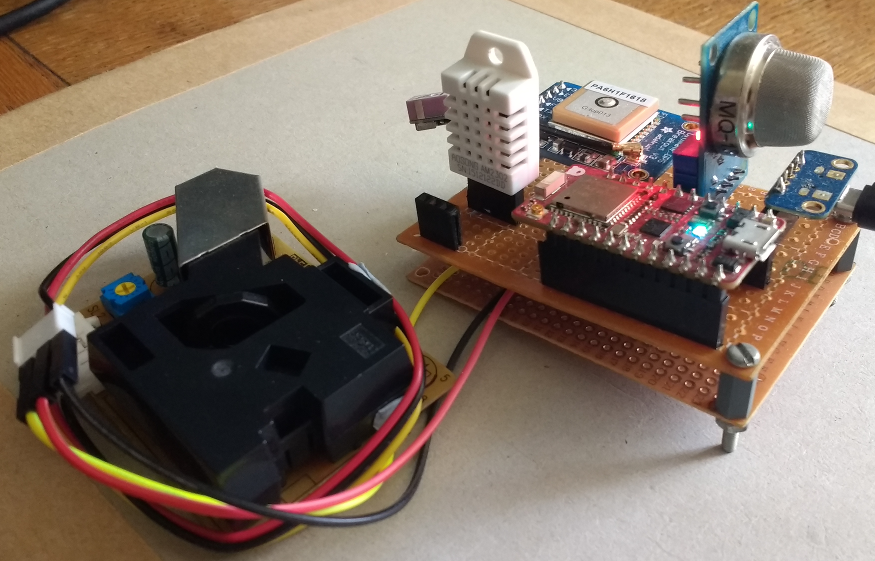

# Portable Air Quality and Pollution Monitoring Sensor
##### Final year project, As part of BSc Computer System Integration at University of the West of England
###### Merlin Roe
--------------
## Abstract
The projects purpose was to research and implement air quality and pollution tracking technologies, within a portable embedded device. Exploring cheap hardware alternatives and free open source tools, to offer a thorough and cost effective form of monitoring.
While offering a simple yet comprehensive way to query and track the air quality, using an interactive heat map from the collected data.

## Hardware
Below is a list of the hardware used for this project:
- Redbear Duo
- Adafruit Ultimate GPS
- MQ135 Semiconductor Sensor
- DHT22
- PPD42NJ Particle Sensor Unit

The hardware specifications are stored within the hardware directory.

## Dependencies
Building this project requires GCC for ARM Cortex processors, due to the redbear Duo using an ARM Cortex M3 CPU.
The build requires version 4.9.3 20150529 or up to version 6 of ARM GCC and will print an error message if the version is older than this.

More information can be found within the firmware [docs](firmware/docs/dependencies.md).

## Download and Build
### Download
Downloading this project requires cloning this Repository with git:

    git clone https://github.com/MerlinR/final_year_project.git

alternatively manually download this repo as a zip, and unpacking in the desired path.
More information can be found within the firmware [docs](firmware/docs/gettingstarted.md).

### Build
Building is done using the make command at the top level directly which is:

    final_year_project/firmware/modules/

The two make commands to clean and build the project are:

    make PLATFORM=duo PARTICLE_DEVELOP=1
    make clean PLATFORM=duo PARTICLE_DEVELOP=1

alternatively the project can be built and ported directly to the Redbear duo using DFU, as long as the board has been set into DFU mode:

    make PLATFORM=duo PARTICLE_DEVELOP=1 -s program-dfu

More information can be found within the firmware [docs](firmware/docs/gettingstarted.md).

## Resources
This project uses the Redbear Duo platform, and this git is forked from the Duo [firmware](https://github.com/redbear/firmware).